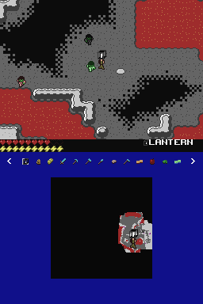

# Minicraft DS Edition

Minicraft DS Edition is a fan port of [Minicraft](http://ludumdare.com/compo/ludum-dare-22/?action=preview&uid=398) for the Nintendo DS

## Notable Version Differences

- Save files (NBT format)
- Loading screen
- Separate button used for interacting with furniture
- New level map on the bottom screen
- Inventory changes:
  - Selecting an item in the inventory doesn't move it to the top
  - Move button for moving items in inventory
  - Opening the inventory doesn't place the cursor at the top
    - Cursor is placed on the active item instead
  - Item wheel and cycle with L/R
  - Touchscreen can be used for player inventory management
- Active item name moved to the bottom screen
- Lighting is lower resolution (1/3)

## Internal Differences

- Two screens, with two screen classes
  - Top screen uses hardware rendering (The 3D engine)
    - Backgrounds as a single rect rather than many tiles to reduce polygon count and bypass color limitations (text + frames)
  - Bottom screen uses mostly the old software rendering code
  - Removed renderLight from screen, now using a LightMask class
  - Additional 2D methods renderPixel, renderBox, renderBoxFilled, renderTexture
- icon.png uses 5 colors
  - Multiples of 51
  - Black is now transparent, other colors are shifted
- Initialization of many interdependent globals is now done in main
- Many direct uses of global objects are switched with IDs
- Circular references removed, replaced with passing in methods by parent instead
  - Game passes references to game and player instead of storing on player + level
- Level generation split into three files based on generator
  - No longer using static class methods
  - New Noise class
- Menus and entities are organized into folders
- Spark entities reference owners using an ID to preserve ownership after reloading

## Screenshots

## TODO

- Drop button
- Instructions in menus
- Utilize touchscreen
  - Marking locations?
- Display something on the bottom screen in the title menus
- Optimize LightMask
